# Original
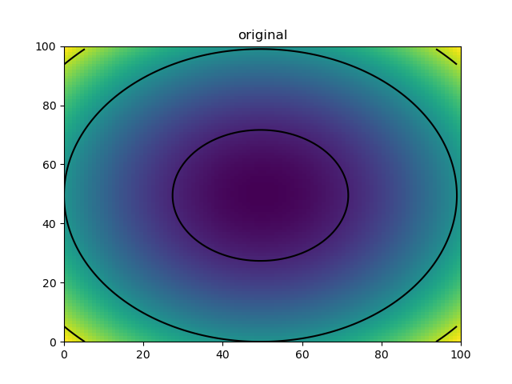
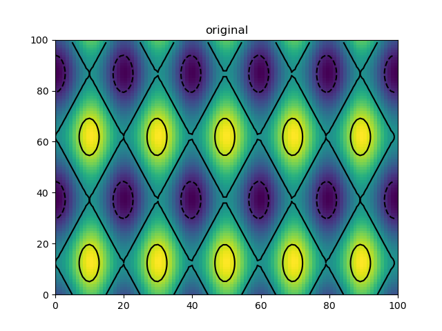

# Augmentations
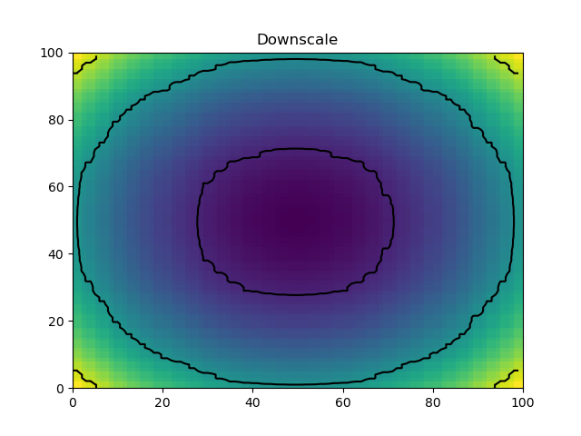
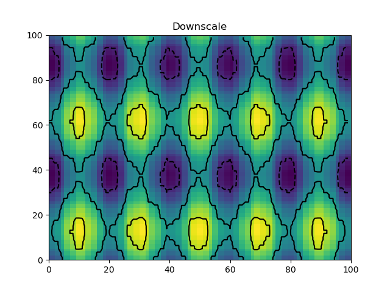
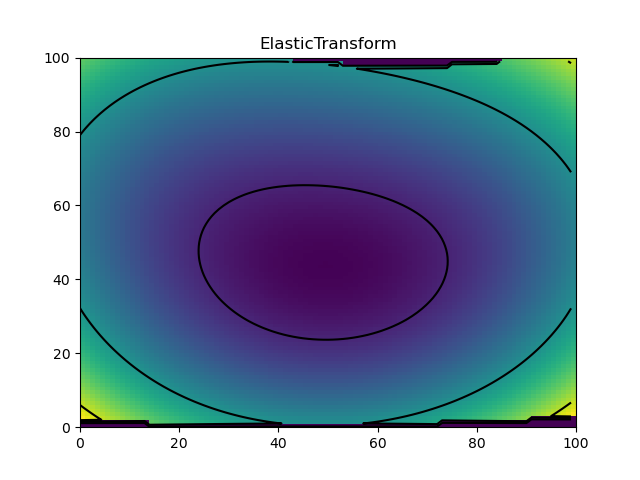
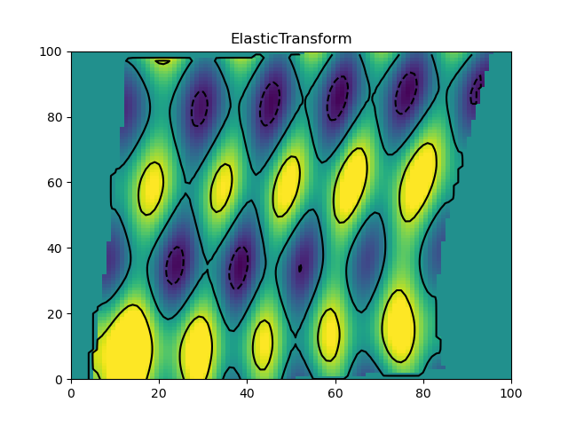
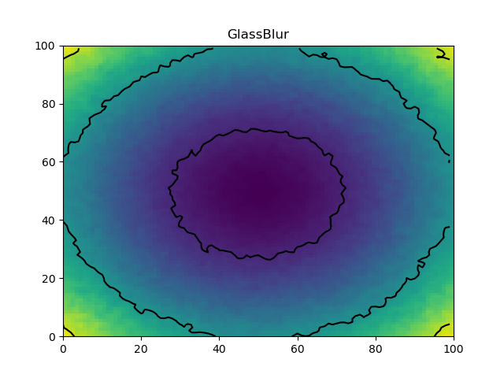
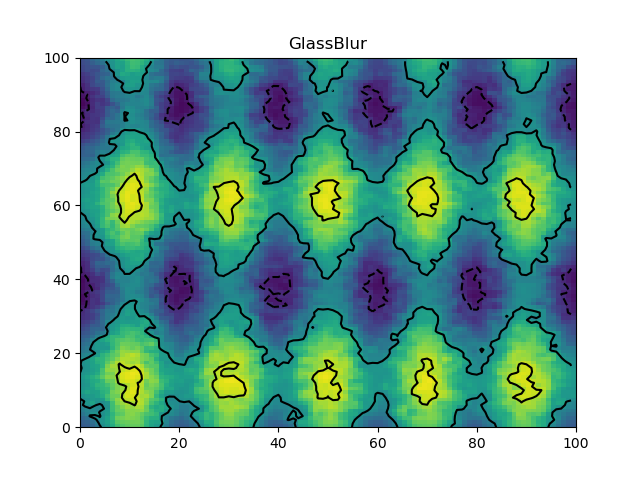
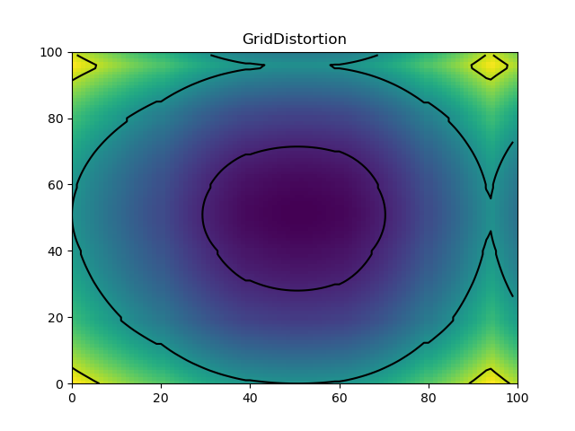
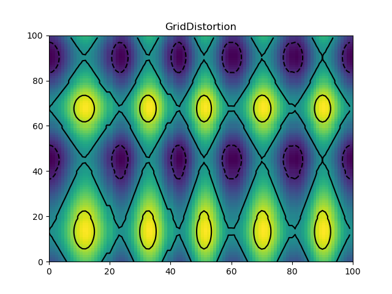
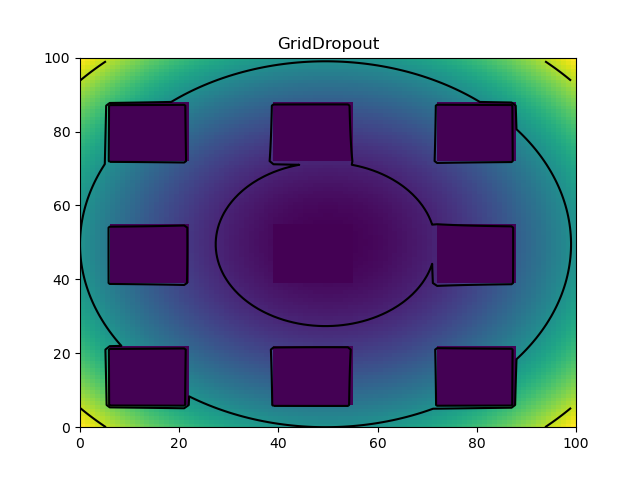
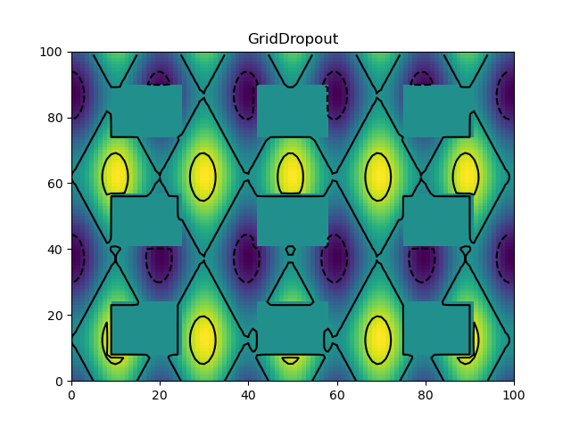
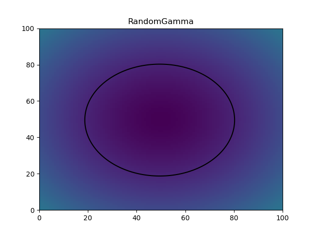
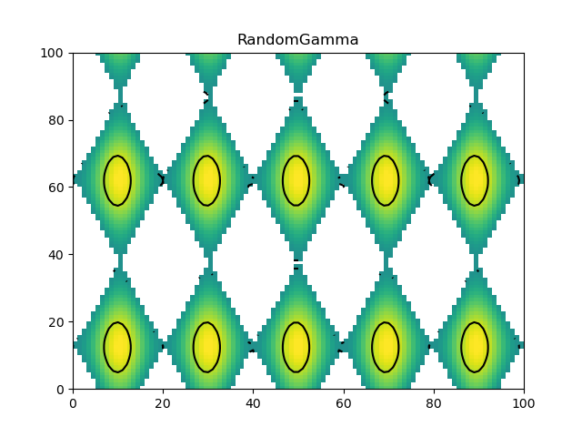
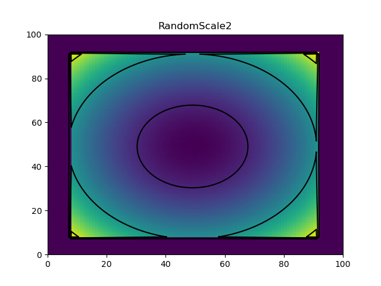
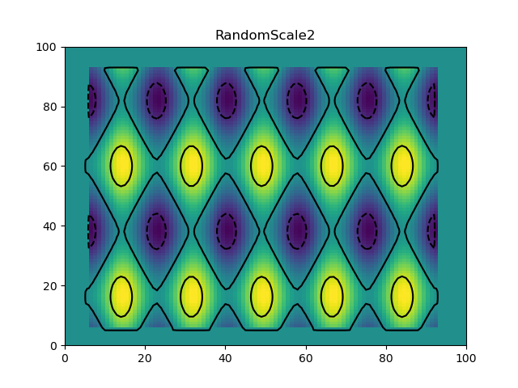
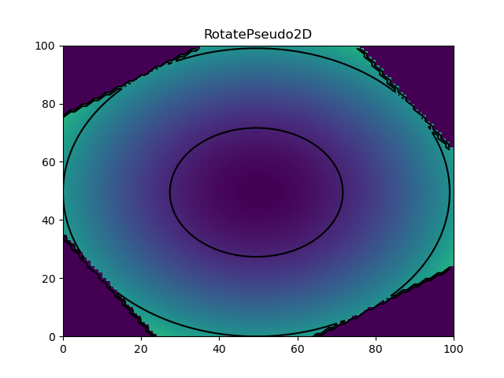
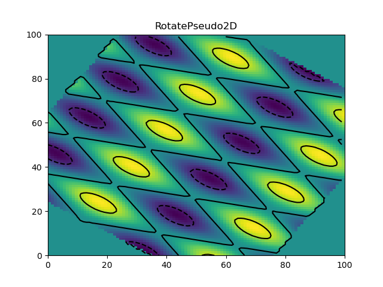

# Code
```python
x = y = z = np.linspace(-10, 10, 100)
X, Y, Z = np.meshgrid(x, y, z)
cube1 = X**2 + Y**2 + Z**2
cube1 = cube1.astype("float32")
cube2 = np.sin(2 * np.pi * X / 10) + Y**2 + np.cos(2 * np.pi * Z / 4)
cube2 = cube2.astype("float32")
cubes = [cube1, cube2]

augmentations = [
    Downscale(.5, .9),
    ElasticTransform((.4, .5)),
    GlassBlur(max_delta=2),
    GridDistortion(),
    GridDropout(holes_number_x=3, holes_number_y=3, holes_number_z=3, random_offset=True),
    RandomGamma(),
    RandomScale2(scale_limit=[0.8, 1.2]),
    RotatePseudo2D((1, 2)),
]
```