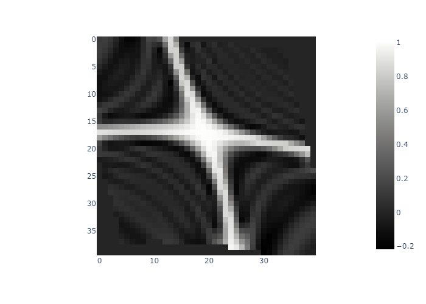
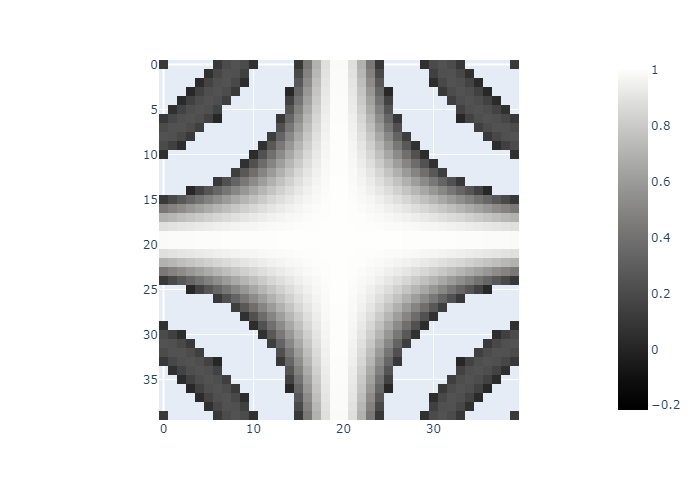

# Function
$$ f(x, y, z) = \frac{\sin(xyz)}{xyz} $$
# No Augmentation

# Downscale

# ElasticTransform

# GlassBlur

# GridDistortion

# GridDropout

# RandomGamma

# RandomScale2

# RotatePseudo2D

